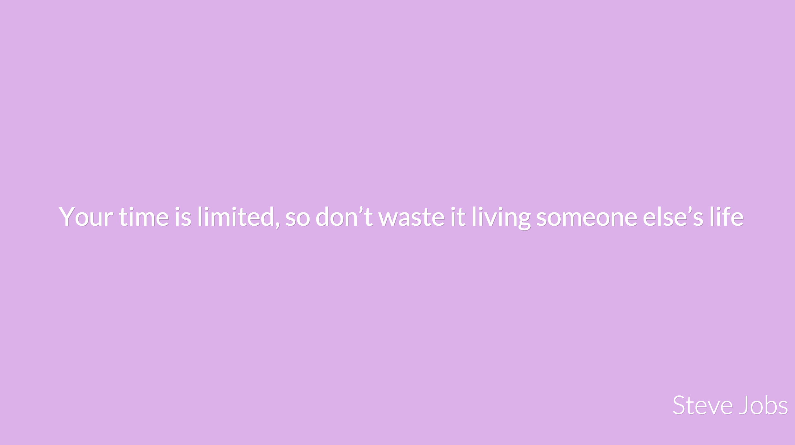

# Assignment 1

## Objective

Demonstrate your mastery of:

- running nodejs
- using express
- connecting to the database
- responding with a file
- responding with JSON
- node module syntax (require/export) using the module design pattern
- npm
- jquery or just javacript in the browser
- ajax


## Requires

- Internet
- Google chrome
- nodejs
- git
- A github account

## Task

Your job is to create a simple test driven inspirational quotes application that will show you a new inspirational quote every-time you click on the page as well as the author of the quote in the bottom right, the quote should be loaded using ajax.

The application should inform the user somehow on how he can use it, in my case I made it so that the first time the app starts it says on the screen that you should click/tap

__A demo that will only work in chrome and basically just looks like what we want you to do can be found [here](http://amrdraz.github.io/inspire-me/)__

### UI




### File structure

After you  __clone__ the assignment repo.

You should minimally windup with the following structure.

```
|  |- public/
|  |  |- js/
|  |  |  |- jquery.min.js  <------ you can optionally not use this.
|  |  |  |- main.js        <------ your javascript file
|  |  |  
|  |  |- css/
|  |  |  |- style.css
|  |  |  
|  |  |- index.html 
|  |
|  |- app.js
|  |- server.js
|  |- quotes.js
|  |- package.json
|  
|- quotes.json
|- .gitignore
|- README.md
```

You will find in this repo the `.gitignore` and `quotes.json` files everything else you have to create yourself.

- `public/js/` Should contain your javascript files.
- `public/css/` Should contain your css files.
- `public/index.html` Should contain the html
- `app.js` contains code that handles the routes and exports the express app.
- `server.js` contains code that runs the app.
- `/quotes.js` should contain the functionality related to quotes
- `package.json` should contain all your dependencies in addition to your npm scripts; start, test, and coverage.
    - the start script runs the database.
    - the test script runs the mocha tests.
    - the coverage script runs istanbul.

### Features

- The app must serve the data from a JSON file.
- The app should implement a simple GET API for getting quotes.
- quotes.js should impliment the functions bellow

#### quotes.js

Export the following functions

##### `getElementByIndexElseRandom(array [, index])` 

- Given an array returns:
    - A random element from the array If index is not passed.
    - The element in the correct index position if it is.

```js
getElementByIndexElseRandom([1, 3, 4])    // any of 1 3 or 4
getElementByIndexElseRandom([1, 3, 4], 0) // always 1
```


##### `getQuotesFromJSON()`

- returns all the quotes as JSON
    
```js
getQuotesFromJSON() // basically returns the whole object.
```

##### `getQuoteFromJSON([index])`

- returns a random quote from the quotes.json file if index is not passed else the on int the index position.

```js
getQuoteFromJSON()           // any of quote object in the quotes.json file
getQuoteFromJSON(0).author   // Kevin Kruse
```
#### API

The server needs to serve index.html when we visit `/index.html`, `index`, or just `/`. Any other url not supported should return a 404 not found.

The following API route endpoint should exist.


##### `/api/quote`

returns a JSON response that was randomly selected from the database

The response should look like this which is basically what you will get from querying the document in mongodb.

```json
{
    "quote": {
        "_id": "theobjectidoftherecord",
        "text": "Nothing Comes to those who wait",
        "author": "Amr Draz"
    }
}
```

#### `/api/quotes`

returns a JSON array as response containing all quotes in the database.

```js
[
    {
        "quote": {
            "_id": "theobjectidoftherecord",
            "text": "Nothing Comes to those who wait",
            "author": "Amr Draz"
        }
    },
    ....
]
```

### Front End requirement

When a user clicks on the page on index.html; a script should send a `GET` request  to `/api/quote`, returning a random quote form the database as JSON, which in turn is then used to update the html page.

### Front End Code

```html

<!DOCTYPE html>
<html>

<head>
    <title>Inspire Me</title>
    <link href='https://fonts.googleapis.com/css?family=Lato:400,300' rel='stylesheet' type='text/css'>
    <style>
    html,
    body {
        position: relative;
        width: 100%;
        height: 100%;
    }

    body {
        text-align: center;
        font-family: Lato, Arial, sans-serif;
        font-size: 100%;
        cursor: pointer;
        background: hsl(400, 60%, 68%);
        display: flex;
        align-items: center;
        justify-content: center;
    }

    .quote {
        font-weight: 400;
        color: #fff;
        text-shadow: 1px 1px 0px rgba(0, 0, 0, 0.2);
        font-size: 5ex;
        padding: 0;
        margin: 0;
        line-height: 1.5;
        max-width: 90%;
    }

    .author {
        position: absolute;
        bottom: 0px;
        right: 20px;
        font-weight: 300;
        font-size: 5ex;
        color: #fff;
        text-shadow: 1px 1px 0px rgba(0, 0, 0, 0.1);
        max-width: 60%;
        align-self: flex-end;
    }
    </style>
</head>

<body>
    <blockquote class="quote">
        Click or tap on the page to get inspired
    </blockquote>
    <h2 class="author"></h2>
    <script>
    var $quote = document.querySelector('.quote');
    var $author = document.querySelector('.author');

    function getElementByIndexElseRandom(array, index) {
        index = index === undefined ? Math.floor(Math.random() * array.length) : index;
        return array[index];
    }
    fetch('./quotes.json').then(function(res) {
        return res.json();
    }).then(function(quotes) {
        document.body.addEventListener('click', function() {
            var quote = getElementByIndexElseRandom(quotes);
            document.body.style.backgroundColor = 'hsl(' + (Math.random() * 360) + ', 55%, 80%)'
            $quote.innerHTML = quote.text;
            $author.innerHTML = quote.author;
        });
    });
    </script>
</body>

</html>

```

#### Other Hints

- You will need to add your dependencies in package.json

- For this assignment you will as a minimum use the npm packages
    - express - for managing your api

- You can look up the documentation of each of these modules and how to use them on your own.

- You don't need to declare a rout for each resource in express you can simply declare a static file directory to server your public folder.

> The quote test should test all functions in quote.js

To test the random selection you can assert that the returned quote is included in one of the quotes you can get from getQuotesFromJSON or when testing the db from getQuotesFromDB

You can read a json file using require `require('../quotes.js')` here I'm assuming quotes.json is one directory up
